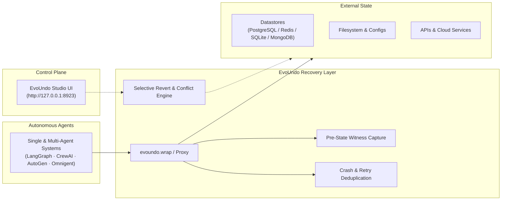

# EvoUndo

> State recoverability, crash reconciliation, and selective undo for autonomous AI agents.

[](LICENSE)
[](tests/)
[](pyproject.toml)
[](https://arxiv.org/abs/2608.28363)
[](docs/)

EvoUndo is a recoverability layer for autonomous agents that modify external state.

When agents break configs or databases, LLM re-prompting cannot reverse committed side effects, and database transactions do not span across worker crashes. EvoUndo captures pre-state witnesses, suppresses duplicate retries, and enables selective rollback of bad mutations without wiping out newer valid work.

---

## Quickstart

### 1. Installation

Install via pip:

```bash
pip install evoundo
```

Or install from source in editable development mode:

```bash
git clone https://github.com/evoundo/evoundo.git
cd evoundo
pip install -e .
```

---

### 2. Pick Your Setup (1 Line)

| Environment | 1-Line Setup | Description |
| :--- | :--- | :--- |
| **Coding Agents & CLI Assistants** | `evoundo wrap <agent>` | Command-line proxy: intercepts file, git, and shell mutations |
| **Python Agent Frameworks** | `agent = wrap(my_agent)` | Python wrapper: auto-protects tools in LangGraph, CrewAI, AutoGen |
| **Custom Functions & Tools** | `@evoundo` or `@protect_tool` | Function decorator: automatic state snapshots and rollback |
| **Visual Local Dashboard** | `evoundo studio` | Browser UI: inspect diffs and trigger 1-click rollbacks |

---

### 3. Five-Second Example: Before vs. After

Protect any file or state-changing function using the `@evoundo` decorator:

```python
from evoundo import evoundo, revert

# 1. Add @evoundo to your tool function
@evoundo
def write_config(path: str, content: str):
    with open(path, "w") as f:
        f.write(content)

# 2. Baseline state: file exists with initial configuration
write_config("app.conf", "workers = 2\n")

# 3. Agent mistake: unintended mutation
write_config("app.conf", "workers = 99999\n")

# 4. Instant rollback: restored to baseline
revert()

with open("app.conf") as f:
    print(f.read())
# Output: "workers = 2\n" (Restored byte-for-byte)
```

To wrap an entire agent instance with multiple tools (e.g. LangGraph, CrewAI):

```python
from evoundo import wrap

agent = wrap(my_agent)
agent.run("Refactor server configuration")
```

---

### 4. Visual Dashboard (Optional)

Prefer a web interface over code or terminal? Launch the local browser dashboard:

```bash
evoundo studio --port 8923
```

Open `http://127.0.0.1:8923` to inspect state diffs, view multi-agent causal graphs, and trigger 1-click rollbacks. See the **[Studio Manual & Screenshots](docs/reference/studio.md)**.

---

## Architecture



---

## When to Use EvoUndo

| Scenario | Without EvoUndo | With EvoUndo |
| :--- | :--- | :--- |
| **Multi-Agent Collaboration** | Reverting one agent's failure via database snapshot or backup wipes out all concurrent progress made by other agents. | Reverts only the failing agent's specific mutations; independent state updates by peer agents remain preserved. |
| **Worker Crashes & Retries** | Process restarts and re-runs tool calls, causing duplicate writes, double-billing, or corrupt state. | Reconciles state across restarts using canonical mutation identity and suppresses duplicate execution. |
| **Multi-Turn Fault Recovery** | LLM re-prompting ("undo what you just did") frequently fails, hallucinates, or generates incomplete inverse queries. | Deterministic rollback restores captured pre-state witnesses without relying on LLM self-correction. |
| **Cross-System Side Effects** | Database `ROLLBACK` cannot undo external filesystem writes, cache updates, or third-party API mutations. | Unified recovery programs span databases, files, caches, and compensable external services. |
| **Selective Rollback** | Reverting an early failure requires wiping all downstream work or restoring full database backups. | Reverts only the targeted mutation; checks causal dependency graphs and refuses rollback (`CONFLICT_DETECTED`) if conflicts exist. |

### Recommended Use Cases
* **Multi-Agent Teams & Swarms:** Teams of agents (CrewAI, AutoGen, LangGraph Multi-Agent, Omnigent) concurrently modifying shared databases or files without risking blanket rollbacks.
* **Autonomous Agents with External Side Effects:** Workflows executing SQL mutations, Redis operations, configuration edits, or mutating API requests.
* **Distributed & Cloud Deployments:** Background workers (Kubernetes pods, Celery, serverless functions) subject to preemption, timeouts, and automatic retry loops.
* **Multi-Step Agent Pipelines:** Complex tasks where an intermediate failure must be rolled back without discarding subsequent independent work.

### When Not to Use
* **Read-Only Agents:** RAG pipelines, search bots, and question-answering systems that do not perform external state mutations.
* **Single-Connection Atomic Transactions:** Operations that occur entirely within a single SQL connection where native `BEGIN ... COMMIT / ROLLBACK` is sufficient.

---

## Key Capabilities

* **Pre-State Witness Capture:** Captures baseline state before a mutation executes.
* **Selective Undo & Conflict Refusal:** Reverts the targeted mutation. If subsequent dependent operations conflict with the rollback, EvoUndo refuses the operation (`CONFLICT_DETECTED`) to prevent inconsistent state.
* **Crash & Retry Deduplication:** Reconciles mutations across worker crashes and restarts to suppress duplicate execution.
* **External State Verification:** Mutation status transitions to `REVERTED` only after datastore probes verify the expected state in the external system.
* **Multi-Agent Causal Independence:** Reverting one agent's action does not overwrite or roll back concurrent independent mutations executed by peer agents.

---

## Supported Ecosystem

| Category | Supported Surfaces |
| :--- | :--- |
| **Datastores** | PostgreSQL · Redis · SQLite · MongoDB · Microsoft SQL Server · SQLAlchemy ORM |
| **Agent Frameworks** | LangGraph · CrewAI · OpenAI Agents SDK · LlamaIndex · PydanticAI · Google ADK · AutoGen |
| **Agent Platforms & Coding Agents** | Claude Code · Cursor · Codex · Omnigent · OpenClaw · Hermes (`evoundo wrap <agent>`) |

---

## Documentation

Comprehensive guides, datastore manuals, and API references are available in the [`docs/`](docs/) directory:

* **[Documentation Portal](docs/README.md)** — Central index of all guides and manuals.
* **[Getting Started Guide](docs/getting-started.md)** — Wrapping agents with `evoundo.wrap()`, handling rollbacks, and Studio UI.
* **[Core Concepts](docs/concepts/recovery-model.md)** — Action classification taxonomy, causal dependency graphs, and crash reconciliation.
* **[Datastore Drivers](docs/drivers/README.md)** — Inversion and witness manuals for PostgreSQL, Redis, SQLite, and MongoDB.
* **[Agent Integrations](docs/integrations/README.md)** — Guides for LangGraph, CrewAI, OpenAI Agents SDK, MCP, and Omnigent.
* **[Python API Reference](docs/reference/api.md)** & **[CLI Reference](docs/reference/cli.md)** — Full function and command signatures.

---

## Research & Citation

EvoUndo is based on the research:

> **EvoUndo: Recoverability-Constrained Self-Evolution for LLM Agent Harnesses**  
> *Tanmay Sah, Dolly Sah, Harshul Jain, Tanya Sah*  
> [https://arxiv.org/abs/2608.28363](https://arxiv.org/abs/2608.28363)

```bibtex
@article{sah2026evoundo,
  title={EvoUndo: Recoverability-Constrained Self-Evolution for LLM Agent Harnesses},
  author={Sah, Tanmay and Sah, Dolly and Jain, Harshul and Sah, Tanya},
  journal={arXiv preprint arXiv:2608.28363},
  year={2026}
}
```

---

## License

EvoUndo software in this repository is licensed under the [PolyForm Noncommercial License 1.0.0](LICENSE).

Under this license, the software is free for noncommercial research, personal, and educational use. Commercial use is not permitted under this license.

See [LICENSE](LICENSE) for the complete terms.