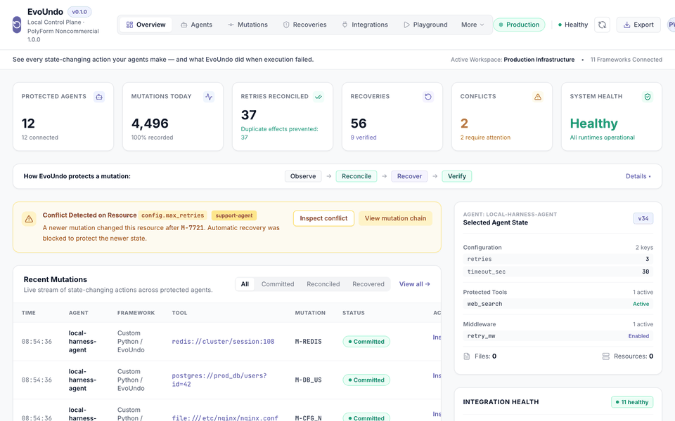
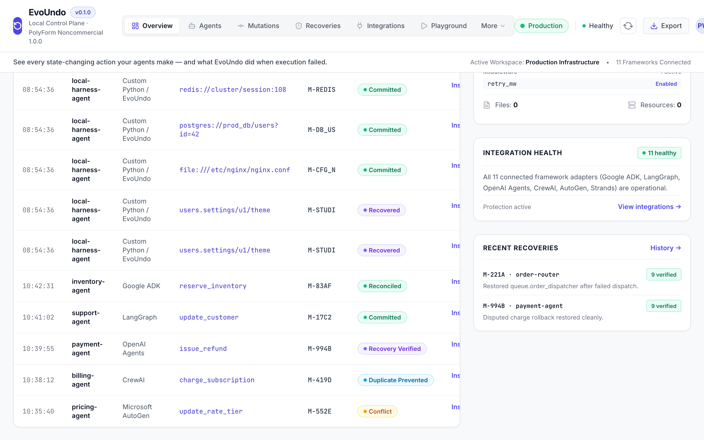
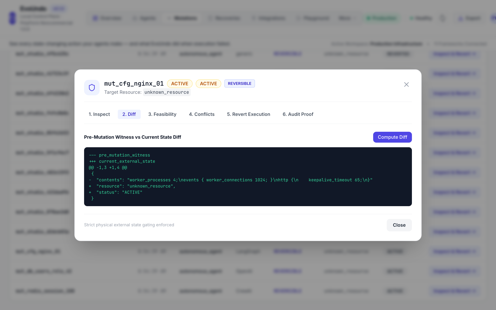

# Local Studio UI

EvoUndo includes a local web-based Studio interface designed for developers and operators to monitor autonomous agent mutations, inspect state diffs, and perform audited recoveries.

---

## 1. Running the Studio

Launch the local Studio UI using the CLI:

```bash
evoundo studio --port 8923
```

Navigate to:
```text
http://127.0.0.1:8923
```

---

## 2. Capabilities

- **Mutation Timeline**: View all agent actions chronologically, categorized by status (`ACTIVE`, `REVERTED`).
- **Diff Inspection**: Inspect before/after JSON diffs, unified text diffs, and database row changes.
- **Feasibility & Conflict Analysis**: Automatically check whether a selected mutation can be cleanly undone or if downstream conflicts prevent rollback.
- **Local Operator Recovery**: Trigger safe, verified rollback directly from the UI with an audit reason.
- **Physical Verification Proofs**: View proof logs confirming that external datastores were probed and verified after recovery.

---

## 3. Visual Interface

### Animated Walkthrough


### Overview Control Plane


### State Diff & Operator Recovery Modal


The local Studio UI runs entirely on localhost and connects directly to your local `.evoundo` workspace.
